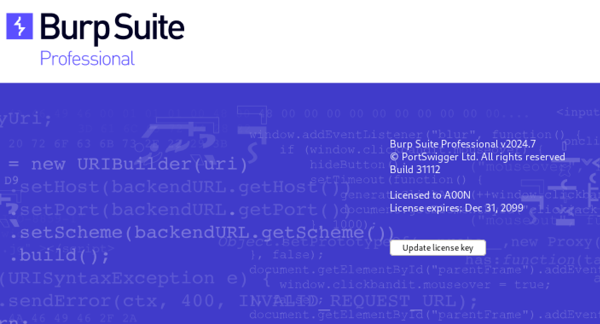

# Burpsuite Pro For Free By A00N

## Step 1: 🌐 Visit the official #PortSwigger releases page at [portswigger](https://portswigger.net/burp/releases#professional) and grab the latest version of Burp Suite Pro in JAR format (in my case is **burpsuite_pro_v2024.7.jar**).


## Step 2: Verify that Java is installed on your system by opening a terminal and typing `java -version`. If Java is installed, you should see the version number displayed. If not, you may need to install Java before proceeding.


## Step 3: ⬇️ Clone this repository using the following command

```bash
git clone https://github.com/Ay0ubN0uri/Burpsuite-pro-for-free
```

cd into the directory and execute the following command:

```bash
cd Burpsuite-pro-for-free
java -jar a00n_burploader.jar
```


👉 **Note:** Place the Burp Suite Pro JAR file (`burpsuite_pro_v2024.7.jar` in this case) in the same folder as `a00n_burploader.jar`.

## Step 4: 👉 Click the Run button to run Burp Suite Pro!


## Step 5: After accepting the license agreement, copy the license key to Burp Suite Pro and click "Next".


## Step 6: Then click on the Manual activation


## Step 7: After that copy the following data to a00n_burploader again


## Step 8: Copy the activation code to burpsuite pro and hit "Next"


## Step 9: Done 😎 you have burpsuite pro setup



